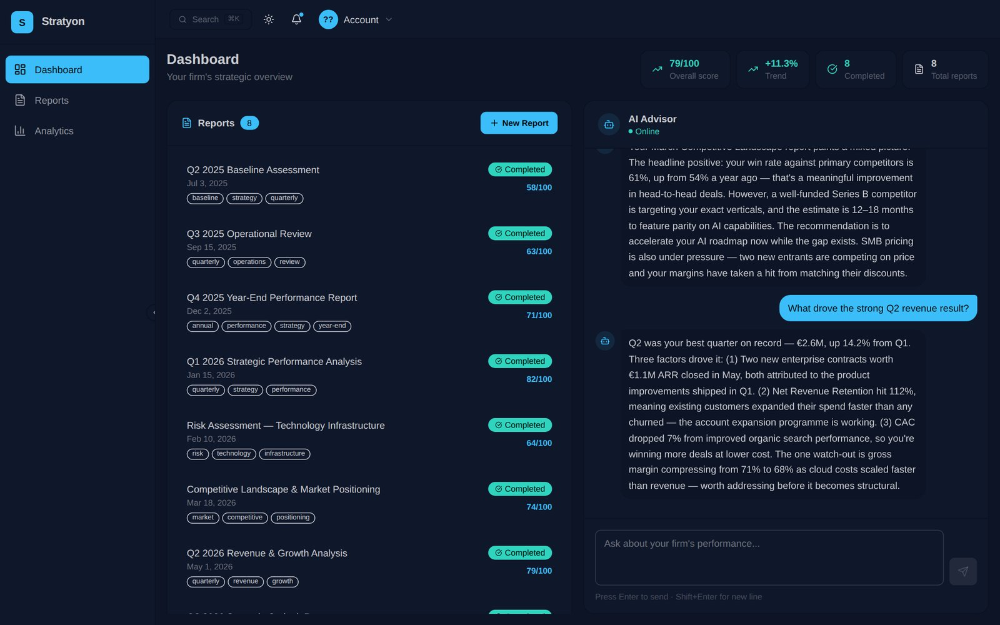
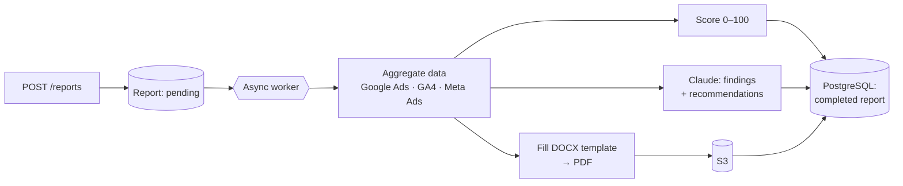

# Stratyon v2 · API

Spring Boot service behind [Stratyon](https://github.com/omeraydmr/stratyonv2-frontend): it turns a company's marketing and analytics data into a scored strategy report, with findings and recommendations written by Claude. It also serves the analytics views and a chat advisor that answers questions using the firm's own report history.



## How a report is generated

`POST /reports` returns immediately; the heavy work runs asynchronously (`@Async`) and the report moves `pending → in_progress → completed | failed`.



## API surface

All paths are under `/api/v1`.

| Area | Endpoints |
|---|---|
| Auth | `POST /auth/register` · `POST /auth/login` · `POST /auth/logout` (JWT, server-side token blocklist) |
| Firms | `POST /firms` · `GET/PATCH /firms/me` · `GET /firms/me/metrics` |
| Reports | `GET/POST /reports` · `GET /reports/{id}` · `/{id}/detail` · `/{id}/download` (PDF from S3) |
| Analytics | `GET /analytics/score-trend` · `/reports-by-month` · `/goal-progress` |
| Chatbot | `GET /chatbot/history` · `POST /chatbot/message` (Claude, grounded in the firm's reports) |
| Notifications | `GET /notifications` · `PATCH /{id}/read` · `PATCH /read-all` |

The full request/response contract, including enums and the error format, is in [`BACKEND_API.md`](BACKEND_API.md).

## Stack

| Area | Choice |
|---|---|
| Runtime | Java 21, Spring Boot 3.3 (Web, Security, Data JPA, Validation) |
| Database | PostgreSQL, schema managed by Flyway (`ddl-auto: validate`) |
| Auth | Stateless JWT (jjwt) with a blocklist for logout |
| AI | Anthropic Messages API via a small typed client (`infrastructure/claude`) |
| Data sources | Google Ads API, Google Analytics 4, Meta Marketing API |
| Documents | Apache POI (DOCX templates), PDFBox |
| Storage | AWS S3 (SDK v2) |
| Packaging | Multi-stage Dockerfile, docker-compose |

## Project layout

Domain-first packages; anything that talks to the outside world lives in `infrastructure/`.

```
com.stratyon.backend
├── domain/           auth · firm · report · analytics · chatbot · notification
├── infrastructure/   claude · datasource (Google Ads, GA4, Meta) · s3 · template
├── shared/           security (JWT filter) · exception handling
└── config/           async, security, S3
```

## Run it

```bash
cp .env.example .env        # fill in DB, JWT secret, and optionally Anthropic / AWS / ads keys
docker compose up -d        # PostgreSQL + API on :8000
```

Or locally with Maven: `mvn spring-boot:run`. The front end can run against this API, or on its own in mock mode.

## Related

- Web app: [stratyonv2-frontend](https://github.com/omeraydmr/stratyonv2-frontend)
- Stratyon v1 (geo-intelligence, Python/FastAPI): [geoint-backend](https://github.com/omeraydmr/geoint-backend)
